[

  

<h3 align="center">
  IT Undergraduate | Full-Stack Developer | Cloud & DevOps Enthusiast
</h3>

  
  
  

  
  
  

---

## 👨‍💻 About Me

- 🎓 IT Undergraduate at the **University of Moratuwa**
- 💻 Full-Stack Developer interested in building scalable software systems
- ☁️ Experienced in **Cloud Computing, DevOps and containerized deployments**
- ⚙️ Experienced with **ASP.NET Core, FastAPI, React and PostgreSQL**
- 🧩 Interested in **Microservices and Distributed Systems**
- 🤖 Experienced with **RAG, Vector Databases and Computer Vision**
- 🔌 Experienced in **IoT and Embedded Systems**
- 🚀 Experienced with **Docker and CI/CD, GitHub Actions**
- 🐧 Comfortable working with **Linux and cloud infrastructure**

---

## 🔭 Currently Working On

- Building distributed backend systems with ASP.NET Core & FastAPI
- Exploring RAG pipelines with vector databases for real-world search applications
- Experimenting with Kubernetes for container orchestration at scale

---

## 💻 Tech Stack

<h3 align="center">Languages</h3>

  

<h3 align="center">Frameworks & Frontend</h3>

  

<h3 align="center">Cloud & DevOps</h3>

  

<h3 align="center">Databases</h3>

  

<h3 align="center">AI, Machine Learning & Vector Search</h3>

  
  
  
  

<h3 align="center">IoT & Embedded</h3>

  
  
  
  

<h3 align="center">Tools & Platforms</h3>

  

---

## 📊 GitHub Statistics

  
  

  

  

  

---

## 👻 Pac-Man Contribution Graph

  <picture>
    <source media="(prefers-color-scheme: dark)" srcset="https://raw.githubusercontent.com/keshaka/keshaka/output/pacman-contribution-graph-dark.svg">
    <source media="(prefers-color-scheme: light)" srcset="https://raw.githubusercontent.com/keshaka/keshaka/output/pacman-contribution-graph.svg">
    
  </picture>

---

## 🤝 Let's Connect

I'm always interested in collaborating on:

- Full-stack applications
- Cloud & DevOps
- Microservices
- AI-powered applications
- Open-source projects

](https://github.com/marketplace/actions/generate-pacman-game-from-github-contribution-grid)
